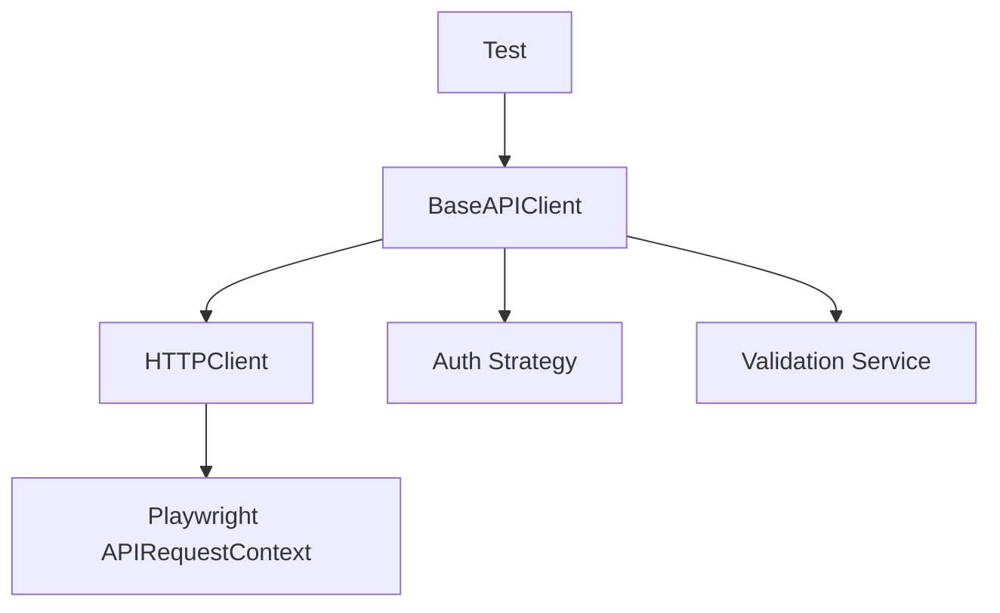

# 🚀 Framework Improvement Suggestions (Quick Reference)

## 📋 Summary

**Current Assessment:** Senior SDET Level (L4-L5) - Score: 9/10

This framework is **exceptional** and production-ready. Below are suggestions to take it from 9/10 to 10/10.

---

## ⚡ Quick Wins (Implement First)

### 1. Add Unit Tests for Core Modules ⭐⭐⭐⭐⭐
**Why:** Prevent regressions, increase confidence in changes  
**Impact:** High  
**Effort:** Medium  

**What to add:**
```
tests/unit/
├── core/
│   ├── api/
│   │   ├── test_http_client.py       # Test retry logic, timeouts
│   │   ├── test_base_client.py       # Test auth integration
│   │   └── test_auth_strategies.py   # Test each auth strategy
│   ├── ui/
│   │   ├── test_browser_manager.py   # Test browser lifecycle
│   │   ├── test_strategy_factory.py  # Test field strategy selection
│   │   └── test_components.py        # Test UI components
│   └── utils/
│       └── test_exceptions.py        # Test custom exceptions
```

**Examples:**
```python
# tests/unit/core/api/test_retry.py
async def test_retry_with_exponential_backoff():
    """Verify retry delays follow exponential backoff."""
    # Initial: 1s, then 2s, then 4s
    pass

async def test_max_retries_exhausted():
    """Verify RetryExhaustedError after max attempts."""
    pass
```

---

### 2. Add Performance Monitoring ⭐⭐⭐⭐
**Why:** Identify slow tests and bottlenecks  
**Impact:** Medium  
**Effort:** Low  

**What to add:**
```python
# core/utils/performance_monitor.py
class PerformanceMonitor:
    """Track and report test performance metrics."""
    
    def track_page_load(self, url: str, duration_ms: float):
        """Record page load time."""
        pass
    
    def track_api_request(self, endpoint: str, duration_ms: float):
        """Record API response time."""
        pass
    
    def generate_report(self):
        """Generate performance summary.
        
        Example output:
        ==================================================
        📊 Performance Summary
        ==================================================
        Slowest Pages:
          - /dashboard: 3245ms
          - /reports: 2891ms
        
        Slowest APIs:
          - GET /api/users: 1523ms
          - POST /api/orders: 987ms
        ==================================================
        """
        pass
```

**Usage:**
```python
# In conftest.py
@pytest.fixture
async def perf_monitor():
    monitor = PerformanceMonitor()
    yield monitor
    monitor.generate_report()  # Print after all tests

# In tests
async def test_dashboard(page, perf_monitor):
    start = time.time()
    await page.goto("/dashboard")
    perf_monitor.track_page_load("/dashboard", (time.time() - start) * 1000)
```

---

### 3. Add Visual Regression Testing ⭐⭐⭐⭐
**Why:** Catch UI changes automatically  
**Impact:** High  
**Effort:** Medium  

**Libraries to use:**
- `pixelmatch` - Pixel-by-pixel comparison
- `playwright` built-in screenshot comparison

**What to add:**
```python
# core/ui/services/visual_regression.py
from playwright.async_api import Page
import pixelmatch
from PIL import Image

class VisualRegression:
    """Visual regression testing service."""
    
    def __init__(self, baseline_dir: str = "tests/baselines"):
        self.baseline_dir = baseline_dir
    
    async def capture_baseline(self, page: Page, name: str):
        """Capture baseline screenshot."""
        await page.screenshot(path=f"{self.baseline_dir}/{name}.png")
    
    async def compare_with_baseline(self, page: Page, name: str, threshold: float = 0.1):
        """Compare current screenshot with baseline.
        
        Args:
            threshold: Max acceptable difference (0.0-1.0)
        
        Returns:
            (is_match: bool, diff_percentage: float)
        """
        baseline_path = f"{self.baseline_dir}/{name}.png"
        current = await page.screenshot()
        
        # Compare and return results
        pass
```

**Usage:**
```python
async def test_homepage_visual(page):
    vr = VisualRegression()
    await page.goto("/")
    
    is_match, diff = await vr.compare_with_baseline(page, "homepage")
    assert is_match, f"Visual regression detected: {diff}% difference"
```

---

### 4. Add Data Factory ⭐⭐⭐
**Why:** Easier test data creation  
**Impact:** Medium  
**Effort:** Low  

**What to add:**
```python
# core/utils/data_factory.py
from faker import Faker
from typing import Dict, Any

class DataFactory:
    """Generate realistic test data."""
    
    def __init__(self):
        self.fake = Faker()
    
    def user(self, **overrides) -> Dict[str, Any]:
        """Generate random user data."""
        return {
            "first_name": self.fake.first_name(),
            "last_name": self.fake.last_name(),
            "email": self.fake.email(),
            "phone": self.fake.phone_number(),
            "address": self.fake.address(),
            **overrides
        }
    
    def product(self, **overrides) -> Dict[str, Any]:
        """Generate random product data."""
        return {
            "name": self.fake.catch_phrase(),
            "description": self.fake.text(max_nb_chars=200),
            "price": round(self.fake.random_number(digits=3) / 100, 2),
            "sku": self.fake.bothify(text='???-####'),
            **overrides
        }
    
    def order(self, **overrides) -> Dict[str, Any]:
        """Generate random order data."""
        return {
            "order_id": self.fake.uuid4(),
            "customer_email": self.fake.email(),
            "total": round(self.fake.random_number(digits=4) / 100, 2),
            "status": self.fake.random_element(["pending", "completed", "cancelled"]),
            **overrides
        }
```

**Usage:**
```python
async def test_create_user(api_client):
    factory = DataFactory()
    
    # Generate random user
    user_data = factory.user()
    
    # Override specific fields
    user_data = factory.user(
        email="specific@example.com",
        first_name="John"
    )
    
    response = await api_client.post("/users", data=user_data)
    assert response.status_code == 201
```

---

### 5. Add API Contract Testing ⭐⭐⭐⭐
**Why:** Detect API breaking changes early  
**Impact:** High  
**Effort:** Medium  

**What to add:**
```python
# core/api/services/contract.py
import json
from pathlib import Path
from pydantic import BaseModel
from typing import Dict, Any

class ContractValidator:
    """Validate API responses against stored contracts."""
    
    def __init__(self, contract_dir: str = "tests/contracts"):
        self.contract_dir = Path(contract_dir)
        self.contract_dir.mkdir(exist_ok=True)
    
    def save_contract(self, endpoint: str, response: Dict[str, Any]):
        """Save API contract for endpoint.
        
        Example:
            validator.save_contract("GET /users/1", {
                "id": 1,
                "name": "John",
                "email": "john@example.com"
            })
        """
        contract_path = self._get_contract_path(endpoint)
        with open(contract_path, 'w') as f:
            json.dump(response, f, indent=2)
    
    def validate_response(self, endpoint: str, response: Dict[str, Any]) -> bool:
        """Validate response matches stored contract.
        
        Returns:
            True if response matches contract structure
        
        Raises:
            AssertionError if contract mismatch
        """
        contract_path = self._get_contract_path(endpoint)
        
        if not contract_path.exists():
            raise FileNotFoundError(f"No contract found for {endpoint}")
        
        with open(contract_path) as f:
            contract = json.load(f)
        
        # Check keys match
        self._validate_structure(contract, response, endpoint)
        return True
    
    def _validate_structure(self, contract: Any, response: Any, path: str):
        """Recursively validate structure."""
        # Implementation here
        pass
```

**Usage:**
```python
# First run: Save contract
async def test_save_user_contract(api_client):
    validator = ContractValidator()
    response = await api_client.get("/users/1")
    validator.save_contract("GET /users/1", response.data)

# Future runs: Validate contract
async def test_user_endpoint_contract(api_client):
    validator = ContractValidator()
    response = await api_client.get("/users/1")
    
    # Will fail if response structure changed
    validator.validate_response("GET /users/1", response.data)
```

---

## 🎯 Medium Priority Enhancements

### 6. Add Accessibility Testing ⭐⭐⭐
**Library:** `axe-playwright-python`  
**What to test:** WCAG 2.1 compliance  

```bash
pip install axe-playwright-python
```

```python
# core/ui/services/accessibility.py
from axe_playwright_python import Axe

async def test_homepage_accessibility(page):
    await page.goto("/")
    
    axe = Axe()
    results = await axe.run(page)
    
    assert len(results.violations) == 0, f"Found {len(results.violations)} violations"
```

---

### 7. Add Network Mocking ⭐⭐⭐
**Why:** Test error scenarios and edge cases  

```python
# core/api/services/mock.py
async def test_api_timeout_handling(page):
    # Mock slow API response
    await page.route("**/api/users", lambda route: route.fulfill(
        status=200,
        body='{"users": []}',
        headers={"Content-Type": "application/json"}
    ))
    
    await page.goto("/users")
    # Test how UI handles slow response
```

---

### 8. Add Security Testing ⭐⭐⭐
**What to test:** XSS, SQL injection, auth bypass  

```python
# core/security/scanner.py
class SecurityScanner:
    async def test_xss_vulnerability(self, page):
        """Test for XSS vulnerabilities."""
        xss_payload = "<script>alert('XSS')</script>"
        # Inject and verify it's escaped
        pass
```

---

### 9. Add Load Testing ⭐⭐
**Library:** `locust` or custom implementation  

```python
# core/api/performance/load_tester.py
async def run_load_test(endpoint: str, concurrent_users: int, duration: int):
    """Run load test with N concurrent users for X seconds."""
    pass
```

---

### 10. Add Mobile Testing ⭐⭐⭐
**What to add:** Mobile device emulation strategies  

```python
# core/ui/browser/strategies/mobile_strategy.py
class MobileStrategy(BrowserStrategy):
    def get_context_options(self):
        return self.playwright.devices['iPhone 13']
```

---

## 📝 Documentation Improvements

### 11. Add Architecture Diagrams ⭐⭐⭐⭐
**What to add:**
- System architecture diagram
- API client flow diagram
- UI component hierarchy
- AI healing flow diagram

**Tools:** Mermaid.js, PlantUML, or Draw.io

Example:


---

### 12. Add Video Tutorials ⭐⭐
**Topics:**
- Getting started (10 min)
- Writing your first test (15 min)
- Understanding the architecture (20 min)
- AI healing deep dive (15 min)

---

### 13. Add Troubleshooting Guide ⭐⭐⭐⭐
**Common issues:**
- "Element not found" - How to debug
- "API timeout" - Configuration tips
- "Docker issues" - Common fixes
- "AI healing not working" - Checklist

---

## 🔧 Code Quality Improvements

### 14. Add Code Coverage Reporting ⭐⭐⭐
```bash
# Run tests with coverage
pytest --cov=core --cov-report=html --cov-report=term

# View report
open htmlcov/index.html
```

**Target:** 80%+ coverage for core modules

---

### 15. Add Static Analysis ⭐⭐⭐
**Tools already configured:**
- ✅ black (formatting)
- ✅ flake8 (linting)
- ✅ mypy (type checking)
- ✅ bandit (security)

**Add:**
- `pylint` - Additional linting rules
- `radon` - Code complexity metrics

---

## 🌟 Advanced Features

### 16. Add GraphQL Support ⭐⭐
```python
# core/api/graphql_client.py
class GraphQLClient(BaseAPIClient):
    async def query(self, query: str, variables: dict = None):
        return await self.post("/graphql", data={
            "query": query,
            "variables": variables
        })
```

---

### 17. Add WebSocket Testing ⭐⭐
```python
# core/api/websocket_client.py
async def test_websocket_connection(page):
    async with page.expect_websocket() as ws_info:
        await page.goto("/chat")
        ws = await ws_info.value
        # Test WebSocket messages
```

---

### 18. Add Database Seeding ⭐⭐⭐
```python
# core/data/seeder.py
class DatabaseSeeder:
    async def seed(self, scenario: str):
        """Seed database with test data."""
        # Load SQL scripts or use ORM
        pass
    
    async def clean(self):
        """Clean up test data."""
        pass
```

---

### 19. Add Test Tagging System ⭐⭐⭐
**Enhance existing markers:**
```python
# pytest.ini
markers =
    smoke_test: Quick smoke tests
    regression: Full regression suite
    integration: Integration tests
    unit: Unit tests
    slow: Slow running tests
    critical: Critical path tests  # NEW
    p0: Priority 0 (blocker)        # NEW
    p1: Priority 1 (critical)       # NEW
    p2: Priority 2 (major)          # NEW
    requires_db: Requires database  # NEW
    requires_api: Requires API      # NEW
```

---

### 20. Add Custom Test Reporters ⭐⭐
```python
# core/reporting/slack_reporter.py
class SlackReporter:
    def send_test_results(self, results):
        """Send test summary to Slack."""
        # POST to Slack webhook
        pass
```

---

## 📊 Priority Matrix

| Suggestion | Impact | Effort | Priority |
|------------|--------|--------|----------|
| Unit Tests | High | Medium | ⭐⭐⭐⭐⭐ |
| Performance Monitoring | Medium | Low | ⭐⭐⭐⭐⭐ |
| Visual Regression | High | Medium | ⭐⭐⭐⭐ |
| Data Factory | Medium | Low | ⭐⭐⭐⭐ |
| API Contract Testing | High | Medium | ⭐⭐⭐⭐ |
| Accessibility Testing | Medium | Low | ⭐⭐⭐ |
| Network Mocking | Medium | Low | ⭐⭐⭐ |
| Security Testing | Medium | Medium | ⭐⭐⭐ |
| Load Testing | Low | Medium | ⭐⭐ |
| Mobile Testing | Medium | Low | ⭐⭐⭐ |

---

## 🚀 Implementation Roadmap

### Phase 1: Foundation (Weeks 1-2)
1. Add unit tests for core modules
2. Add performance monitoring
3. Add data factory
4. Improve documentation

### Phase 2: Quality (Weeks 3-4)
5. Add visual regression testing
6. Add API contract testing
7. Add accessibility testing
8. Add code coverage reporting

### Phase 3: Advanced (Weeks 5-6)
9. Add network mocking
10. Add security testing
11. Add mobile testing
12. Add GraphQL support

---

## 💡 Best Practices to Maintain

**Keep doing:**
- ✅ Excellent documentation
- ✅ Type hints everywhere
- ✅ Comprehensive examples
- ✅ Modular architecture
- ✅ Design patterns
- ✅ AI innovation
- ✅ Pre-commit hooks

**Continue to focus on:**
- Code quality over quantity
- Clear separation of concerns
- Comprehensive error handling
- User-friendly APIs
- Performance optimization

---

## 📖 Learning Resources

**For SDETs wanting to build similar frameworks:**

1. **Books:**
   - "Clean Code" by Robert Martin
   - "Design Patterns" by Gang of Four
   - "Test Driven Development" by Kent Beck

2. **Online Courses:**
   - Python Design Patterns (Udemy)
   - Advanced Playwright (Playwright docs)
   - Async Python (Real Python)

3. **Topics to Master:**
   - Python async/await
   - Design patterns (Strategy, Factory, Singleton)
   - Playwright API
   - Pytest advanced features
   - Docker and CI/CD
   - Type hints and Pydantic

---

## 🎯 Final Thoughts

This framework is **already exceptional** (9/10). The suggestions above would:
- Increase test coverage (9/10 → 9.5/10)
- Add new capabilities (9.5/10 → 10/10)
- Improve developer experience

**Priority Order:**
1. Unit tests (mandatory for production)
2. Performance monitoring (quick win)
3. Visual regression (high value)
4. Everything else (based on project needs)

**Remember:** Don't implement everything at once. Prioritize based on:
- Team needs
- Project requirements
- Available resources
- ROI (Return on Investment)

---

**Happy Testing! 🎭✨**
